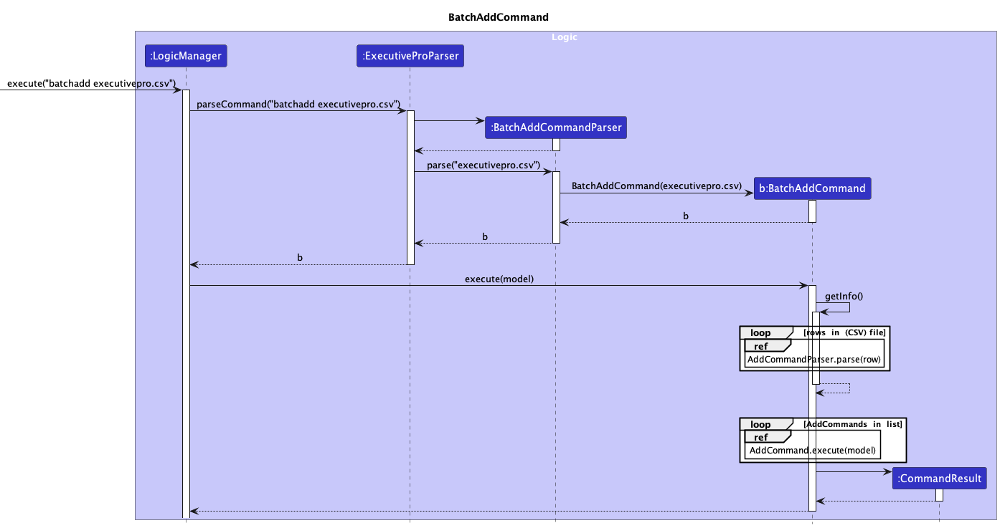
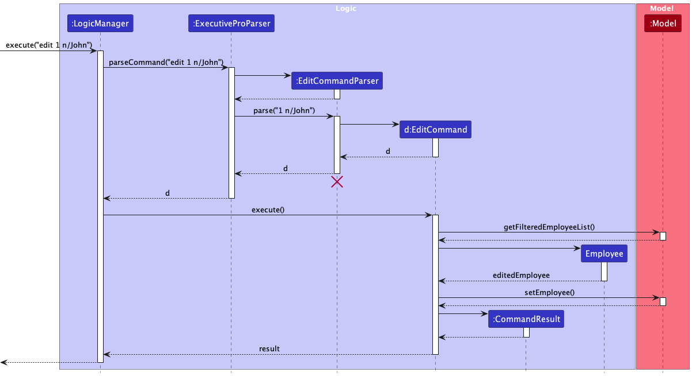
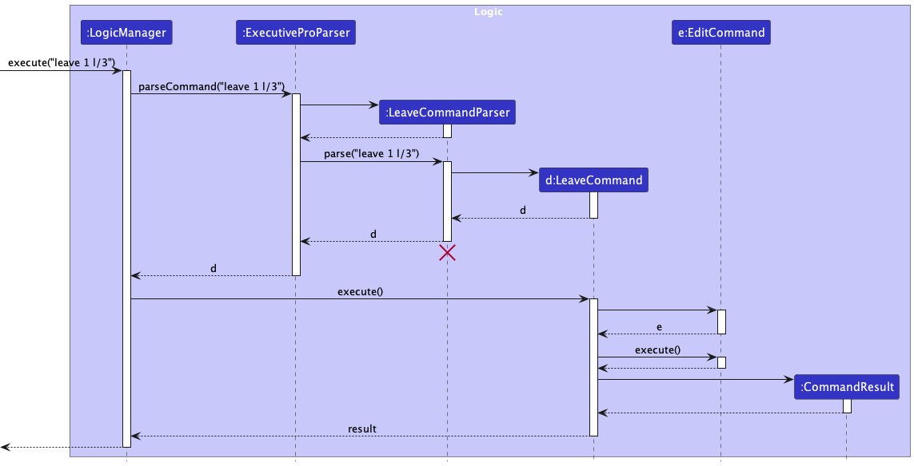
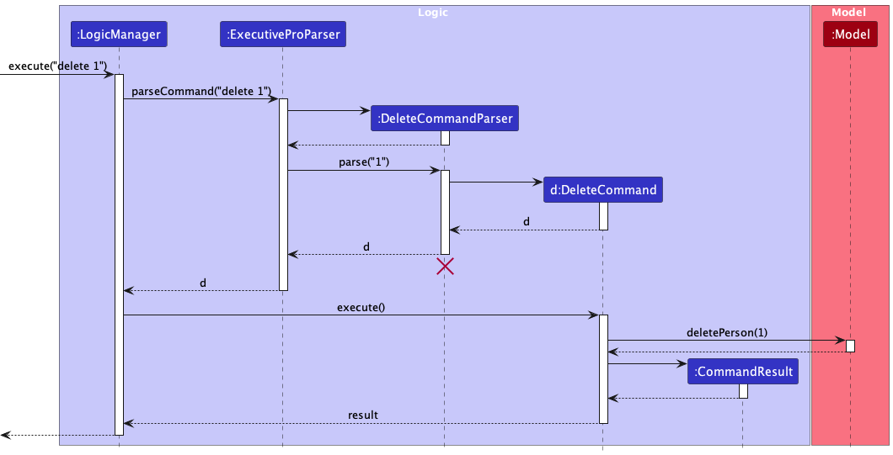
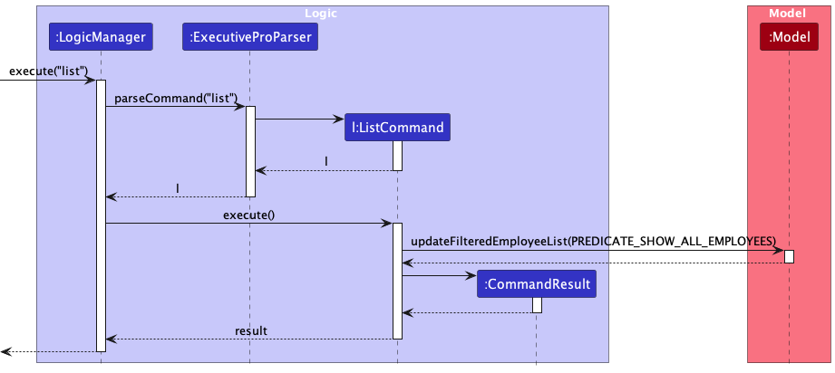
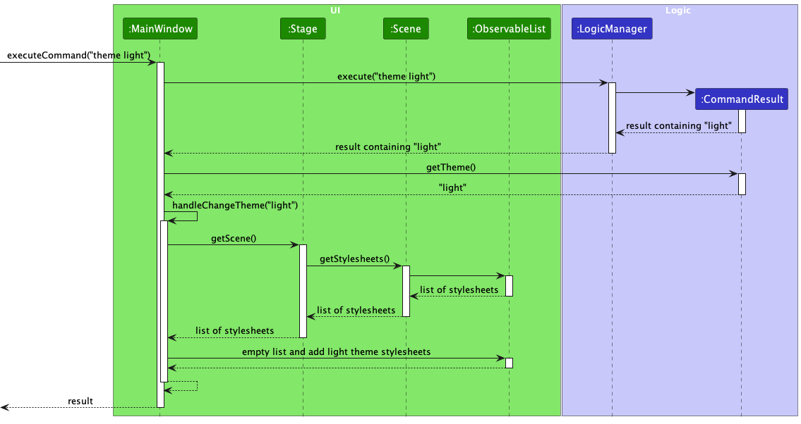
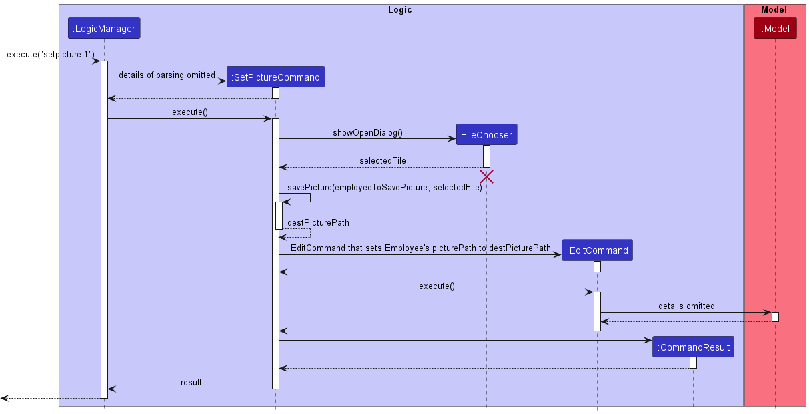
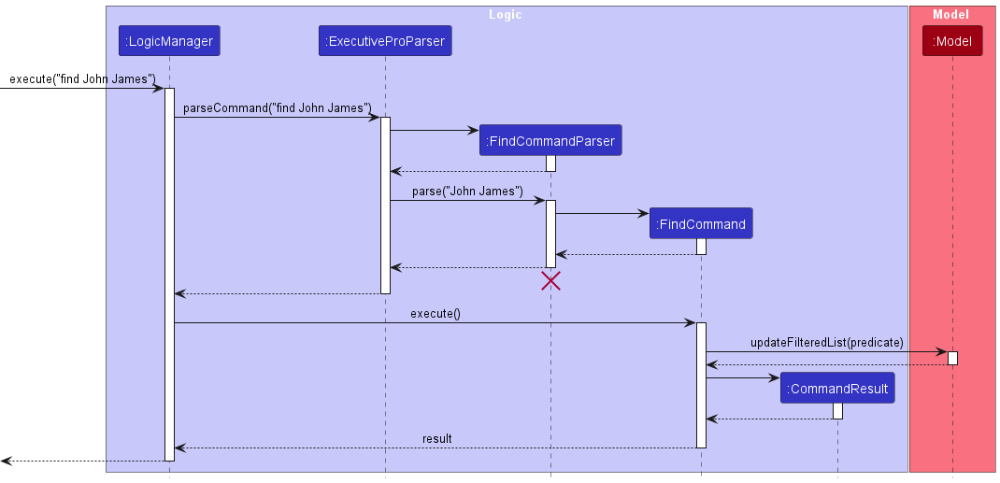
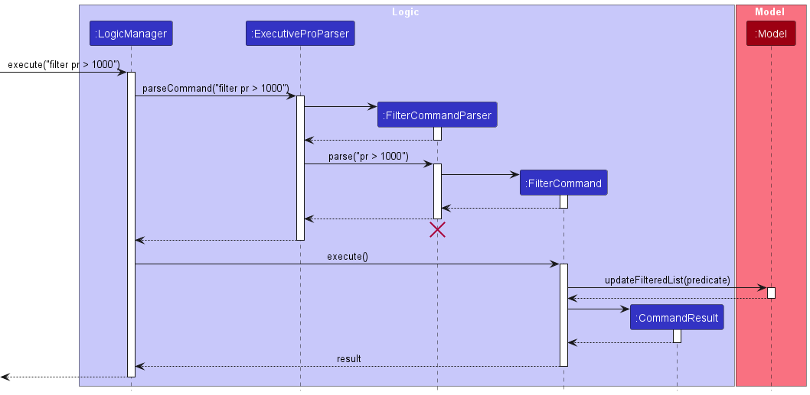

## About ExecutivePro

--------------------------------------------------------------------------------------------------------------------
_ExecutivePro (EP)_ is a **desktop app** for **Human Resource (HR) managers** to manage their employee information, optimized for use via a **Command Line Interface (CLI)** while still having the benefits of a Graphical User Interface (GUI).

It allows HR Managers to:
1. Manage employees and their details
2. Find or filter employees according to various criterion
3. Export and import data from _ExecutivePro_ to other formats

The purpose of this Developer Guide is to record the design and development of _ExecutivePro_, with the intention of assisting developers in understanding the thought process behind each feature. Alongside this, the guide offers a comprehensive overview of the architecture of _ExecutivePro_, both at a macro and micro level, aimed at aiding new developers in navigating through the code base.

--------------------------------------------------------------------------------------------------------------------

## Symbols and Syntax

Here are some of the symbols to take note of when going through this user guide:

| Symbol               | Meaning                                                           |
|----------------------|-------------------------------------------------------------------|
| `code`               | Text relevant to commands or name of a file.                      |
| [`code`]             | The brackets around the code indicate that the field is optional. |
| :bulb:               | Tips for ExecutivePro Users.                                      |
| :warning:            | Be wary and proceed with caution.                                 |
| :information_source: | Take note.                                                        |

* Table of Contents
{:toc}

## **Acknowledgements**

* This project is based on the AddressBook-Level3 project created by the [SE-EDU initiative](https://se-education.org/addressbook-level3/)

--------------------------------------------------------------------------------------------------------------------

## **Setting up, getting started**

Refer to the guide [_Setting up and getting started_](SettingUp.md).

--------------------------------------------------------------------------------------------------------------------

## **Design**

:bulb: **Tip:** The `.puml` files used to create diagrams in this document can be found in the [diagrams](https://github.com/AY2223S2-CS2103T-W09-4/tp/tree/master/docs/diagrams) folder. Refer to the [_PlantUML Tutorial_ at se-edu/guides](https://se-education.org/guides/tutorials/plantUml.html) to learn how to create and edit diagrams.

### Architecture

The ***Architecture Diagram*** given above explains the high-level design of the App.

Given below is a quick overview of main components and how they interact with each other.

**Main components of the architecture**

**`Main`** has two classes called [`Main`](https://github.com/AY2223S2-CS2103T-W09-4/tp/blob/master/src/main/java/seedu/address/Main.java) and [`MainApp`](https://github.com/AY2223S2-CS2103T-W09-4/tp/blob/master/src/main/java/seedu/address/MainApp.java). It is responsible for,
* At app launch: Initializes the components in the correct sequence, and connects them up with each other.
* At shut down: Shuts down the components and invokes cleanup methods where necessary.

[**`Commons`**](#common-classes) represents a collection of classes used by multiple other components.

The rest of the App consists of four components.

* [**`UI`**](#ui-component): The UI of the App.
* [**`Logic`**](#logic-component): The command executor.
* [**`Model`**](#model-component): Holds the data of the App in memory.
* [**`Storage`**](#storage-component): Reads data from, and writes data to, the hard disk.

**How the architecture components interact with each other**

The *Sequence Diagram* below shows how the components interact with each other for the scenario where the user issues the command `delete 1`.

Each of the four main components (also shown in the diagram above),

* defines its *API* in an `interface` with the same name as the Component.
* implements its functionality using a concrete `{Component Name}Manager` class (which follows the corresponding API `interface` mentioned in the previous point.

For example, the `Logic` component defines its API in the `Logic.java` interface and implements its functionality using the `LogicManager.java` class which follows the `Logic` interface. Other components interact with a given component through its interface rather than the concrete class (reason: to prevent outside component's being coupled to the implementation of a component), as illustrated in the (partial) class diagram below.

The sections below give more details of each component.

### UI component

The **API** of this component is specified in [`Ui.java`](https://github.com/AY2223S2-CS2103T-W09-4/tp/blob/master/src/main/java/seedu/address/ui/Ui.java)

The UI consists of a `MainWindow` that is made up of parts e.g.`CommandBox`, `ResultDisplay`, `PersonListPanel`, `StatusBarFooter` etc. All these, including the `MainWindow`, inherit from the abstract `UiPart` class which captures the commonalities between classes that represent parts of the visible GUI.

The `UI` component uses the JavaFx UI framework. The layout of these UI parts are defined in matching `.fxml` files that are in the `src/main/resources/view` folder. For example, the layout of the [`MainWindow`](https://github.com/AY2223S2-CS2103T-W09-4/tp/blob/master/src/main/java/seedu/address/ui/MainWindow.java) is specified in [`MainWindow.fxml`](https://github.com/AY2223S2-CS2103T-W09-4/tp/blob/master/src/main/resources/view/MainWindow.fxml)

The `UI` component,

* executes user commands using the `Logic` component.
* listens for changes to `Model` data so that the UI can be updated with the modified data.
* keeps a reference to the `Logic` component, because the `UI` relies on the `Logic` to execute commands.
* depends on some classes in the `Model` component, as it displays `Person` object residing in the `Model`.

### Logic component

**API** : [`Logic.java`](https://github.com/AY2223S2-CS2103T-W09-4/tp/blob/master/src/main/java/seedu/address/logic/Logic.java)

Here's a (partial) class diagram of the `Logic` component:

How the `Logic` component works:
1. When `Logic` is called upon to execute a command, it uses the `ExecutiveProParser` class to parse the user command.
1. This results in a `Command` object (more precisely, an object of one of its subclasses e.g., `AddCommand`) which is executed by the `LogicManager`.
1. The command can communicate with the `Model` when it is executed (e.g. to add a employee).
1. The result of the command execution is encapsulated as a `CommandResult` object which is returned back from `Logic`.

The Sequence Diagram below illustrates the interactions within the `Logic` component for the `execute("delete 1")` API call.

:information_source: **Note:** The lifeline for `DeleteCommandParser` should end at the destroy marker (X) but due to a limitation of PlantUML, the lifeline reaches the end of diagram.

Here are the other classes in `Logic` (omitted from the class diagram above) that are used for parsing a user command:

How the parsing works:
* When called upon to parse a user command, the `ExecutiveProParser` class creates an `XYZCommandParser` (`XYZ` is a placeholder for the specific command name e.g., `AddCommandParser`) which uses the other classes shown above to parse the user command and create a `XYZCommand` object (e.g., `AddCommand`) which the `ExecutiveProParser` returns back as a `Command` object.
* All `XYZCommandParser` classes (e.g., `AddCommandParser`, `DeleteCommandParser`, ...) inherit from the `Parser` interface so that they can be treated similarly where possible e.g, during testing.

### Model component
**API** : [`Model.java`](https://github.com/AY2223S2-CS2103T-W09-4/tp/blob/master/src/main/java/seedu/address/model/Model.java)

The `Model` component,

* stores the ExecutivePro data i.e., all `Person` objects (which are contained in a `UniquePersonList` object).
* stores the currently 'selected' `Person` objects (e.g., results of a search query) as a separate _filtered_ list which is exposed to outsiders as an unmodifiable `ObservableList<Person>` that can be 'observed' e.g. the UI can be bound to this list so that the UI automatically updates when the data in the list change.
* stores a `UserPref` object that represents the user’s preferences. This is exposed to the outside as a `ReadOnlyUserPref` objects.
* does not depend on any of the other three components (as the `Model` represents data entities of the domain, they should make sense on their own without depending on other components)

:information_source: **Note:** An alternative (arguably, a more OOP) model is given below. It has a `Tag` list in the `ExecutivePro`, which `Person` references. This allows `ExecutivePro` to only require one `Tag` object per unique tag, instead of each `Person` needing their own `Tag` objects. 

### Storage component

**API** : [`Storage.java`](https://github.com/AY2223S2-CS2103T-W09-4/tp/blob/master/src/main/java/seedu/address/storage/Storage.java)

The `Storage` component,
* can save both address book data and user preference data in json format, and read them back into corresponding objects.
* inherits from both `ExecutiveProStorage` and `UserPrefsStorage`, which means it can be treated as either one (if only the functionality of only one is needed).
* depends on some classes in the `Model` component (because the `Storage` component's job is to save/retrieve objects that belong to the `Model`)

### Common classes

Classes used by multiple components are in the `seedu.address.commons` package.

--------------------------------------------------------------------------------------------------------------------

## **Implementation**

This section describes some noteworthy details on how certain features are implemented.
### Add Feature : `add`

#### Implementation
This section explains the implementation of the `add` feature.
The command takes in one parameter which is the employee name, executing the command leads to the addition of an
employee into the ExecutivePro database.

Below is a sequence diagram and the explanation of `add` command.

Step 1. Users will enter the command `add n/John Doe p/98765432 e/johnd@example.com a/311, Clementi Ave 2, #02-25
d/Marketing`.

Step 2. `LogicManager#execute` method is called on the user input. This prompts the `AddCommandParser`
to parse the user input. This creates a `AddCommand` object.

Step 3. The `execute` method of `AddCommand` will be called, it returns a `CommandResult`object.

Step 4. This adds the `employee` from the list to the model. The `employeeId` will be set and if there
currently exists an `employee` object with the same field data, a `CommandException` will be thrown and
a message indicating duplicate person will be shown.

Step 5. `storage#saveExecutiveProDb()` is then called, and updates the storage to contain the new `employee`.

### BatchAdd feature: `batchadd`

This feature is created for users to add multiple entries at once.
In the case of this application, there are two main reasons why HR managers would use this.

1. User is new and needs to import all the current data into the database.
2. There is a new recruitment cycle and company has recruited a large number of employees.

Moving on to the implementation, some things to note.

- As of now, our feature only accommodates adding from a CSV file.
- Fields does not allow for commas inside.

These are possible things to work on for future iterations.

#### Implementation:

_Pre-requisites: User has a CSV file filled with whatever information they want to `batchadd`
and has stored it in the `/data` folder of the repository._

UML Diagram:

**Steps:**

Step 1. User launches the application.

Step 2. User executes `batchadd filename` command. In the `LogicManager` class, the `ExecutiveProParser` method is called.
This will return a new `BatchAddCommandParser` object and `parse` function is then called.
A helper function in `ParserUtil` helps to trim the filename and check if it is valid.

Note: If no argument is provided or file not in CSV format, a`ParseException` will be thrown.

Step 3. The `parse` function returns a `BatchAddCommand` which is then executed. In this `execute` function, the first
step would be to read the information in the CSV file (`getInfo` function). A `BufferedReader` object is used to read the CSV file and converts
each row to a string of arguments (following the add command requirements) and creates a new `AddCommand`. These new `AddCommands` will be added
into a `List<AddCommand>`.

Note: If file does not exist in the folder, a `FileNotFound` exception is thrown too.

Step 4. Once `getInfo` returns a `List<AddCommand>`, the list will then be iterated through to execute each `AddCommand`.
If there is any duplicate Person found, the function call will be aborted and the database will be reverted to its original state.

Step 5. `storage#saveExecutiveProDb` is then called on the current `database`, updates the database to contain the new persons added.

<h4 id="batch-add-feature-design-considerations">Design Considerations</h4>

##### Aspect: How Batchadd is run

- Alternative 1 (Current Choice): Make use of the execution of the `AddCommand`.
    - Pros: Makes use of the Error Handling that the `AddCommand` has.
    - Cons: `BatchAdd` will fail if Add fails.
- Alternative 2: Own implementation of `BatchAdd` without relying on `AddCommand`.
    - Pros: If Add Fails, BatchAdd can still work.
    - Cons: Implementation Heavy.

##### Aspect: How Batchadd `.csv` file is processed

- Alternative 1 (Current Choice): Use the positioning of columns to import data (i.e Have a fixed row position for each command).
    - Pros: No need for header rows
    - Cons: If the user orders it wrongly, it will not work.
- Alternative 2: Use the Header row to determine the data used.
    - Pros: No need to follow a specific ordering.
    - Cons: Name of headers need to be the exact name used.

### Edit Feature : `edit`

#### Implementation
This section explains the implementation of the `edit` feature.
The command takes in a first parameter which is the unique employee ID, then one or more other employee details that the user wants to edit.
Executing the command edits the details of the employee into the ExecutivePro database.

Below is a sequence diagram and the explanation of `edit` command.

Step 1. A user wants to change the name of the employee with ID of 1 to Jane. User will enter the command `edit 1 n/John`.

Step 2. `LogicManager#execute` method is called on the user input. This prompts the `EditCommandParser`
to parse the user input. This creates a `EditCommand` object containing a `EditEmployeeDescriptor` object that contains the new details.

Step 3. The `execute` method of `EditCommand` will be called, it returns a `CommandResult`object.

Step 4. The `Model#getFilteredEmployeeList()` method is used to find the employee to be edited. If there is no employee with the given ID, a `CommandException` will be thrown and
a message indicating no such employee will be shown. If an employee with the given ID exists, a new `employee` object is created with the updated details, and it replaces the old employee using `Model#setEmployee()`.

Step 5. `storage#saveExecutiveProDb()` is then called, and updates the storage to contain the new `employee`.

### Leave Feature : `leave`

#### Implementation
This section explains the implementation of the `leave` feature.
The command takes in a first parameter which is the unique employee ID, then one integer which is the number of days of leave to take.
Executing the command reduces the number of days of leave of the employee into the ExecutivePro database (if employee has enough leave).

Below is a sequence diagram and the explanation of `leave` command.

Step 1. A user wants to help the employee with ID of 1 to take 3 days of leave. User will enter the command `leave 1 l/3`.

Step 2. `LogicManager#execute` method is called on the user input. This prompts the `LeaveCommandParser`
to parse the user input. This creates a `LeaveCommand` object with the `EmployeeId` and number of days of leave.

Step 3. The `execute` method of `LeaveCommand` will be called. A `CommandException` will be thrown if days of leave is not in range 0-365 (inclusive) and a message indicating the error is shown.

Step 4. The `Model#getFilteredEmployeeList()` method is used to find the employee to be edited. If there is no employee with the given ID, a `CommandException` will be thrown and
a message indicating no such employee will be shown. A `CommandException` will be thrown if employee does not have enough leave.

Step 5. An equivalent `EditCommand` is created to update the leave count of the employee. The `execute` method of the `EditCommand` will be called.

Step 6. `storage#saveExecutiveProDb()` is then called, and updates the storage to contain the new `employee`.

### Delete Feature : `delete`

#### Implementation

This section explains the implementation of the `delete` feature.
The command takes in one parameter which is the employee ID, executing the command leads to the removal of the employee
with that specific employee ID
Below is a sequence diagram and the explanation of `delete` command.

Step 1. Users will enter the command `delete 1`.

Step 2. `LogicManager#execute` method is called on the user input. This prompts the `DeleteCommandParser` to
parse the user input.
This creates a `DeleteCommand` object.

Step 3. The `execute` method of `DeleteCommand` will be called, it returns a `CommandResult`object.

Step 4. This finds the `employee` with an Employee ID of 1. If there is no employee with the Employee ID 1, a
`CommandException` will be thrown and a message indicating invalid Employee ID will be returned. However,
if there is an employee with the given employee ID, then using `model#deletePerson()`, the person will be deleted
from the database.

Step 5. `storage#saveExecutiveProDb()` is then called, and updates the storage to remove the employee.

### List Feature: `list`
This command displays the details of all employees in order of their employee ID.

#### Implementation

The list of employees to be displayed is stored in the `Model` as a `FilteredList`, which is based on the full source list of all employees.
When a `Predicate` is set for the `FilteredList`, the `FilteredList` will contain only the employees in the source list that satisfy the `Predicate`.

Below is a sequence diagram and the explanation of the `list` command.

Step 1. User enters the command `list`.

Step 2. `LogicManager#execute` method is called on the user input.
This prompts the `ExecutiveProParser` to parse the user input, which then returns a `ListCommand` object.

Step 3. The `execute` method of this `ListCommand` is then called, which uses `ModelManager#UpdateFilteredEmployeeList` to set the `Predicate` of the `FilteredList` to one that always evaluates to `true` for any `Employee`.

Step 4. Every `Employee` now satisfies the `Predicate`, so the `FilteredList` updates to contain every employee in the source list.

Step 5. The `UI` component listens to changes in this `FilteredList`, and updates the GUI to display this list of all employees to the user.

### Change Theme Feature: `theme`
This command changes the appearance of ExecutivePro's GUI to the specified theme.
`theme light` displays black text on a light background, while `theme dark` displays white text on a dark background.

#### Implementation

The appearance of ExecutivePro's GUI is determined by the CSS stylesheets used by its JavaFX `Scene`.
The `theme` command changes the GUI theme by swapping out these CSS stylesheets for the appropriate stylesheets matching the specified theme, as shown below.

Step 1. User enters a valid command, e.g. `theme light`.

Step 2. `LogicManager` parses and executes the command, and returns to the `MainWindow` a `CommandResult` object containing the specified theme "light".

Step 3. `MainWindow` gets the theme "light" from the `CommandResult`,  then calls its own `handleChangeTheme` method with this theme.

Step 4: The `handleChangeTheme` method gets the list of all stylesheets used by the current `Scene`, empties the list, and adds in the desired stylesheets matching the theme "light".

Step 5. The `UI` component listens to this change in the list of stylesheets to use, and updates the GUI's appearance accordingly.

### Set Picture Feature: `setpicture`
This command allows the user to select an image file from their computer,
and sets that image as the profile picture for the specified employee.

Note: ExecutivePro currently only accepts images in the `.jpg`, `.jpeg`, or `.png` file format.

#### Implementation

`Employee` objects have a `picturePath` field that represents the file path where the employee's profile picture is stored on the user's computer.
The `setpicture` feature makes use of the [`edit` feature](#edit-feature--edit) to set the `picturePath` of an `Employee` to the file path of the selected image,
as shown below:

Step 1. User enters a valid command, e.g. `setpicture 1`, to set the profile picture of the employee with employee ID 1.

Step 2. `LogicManager#execute` method is called to parse the user input as described in the [Logic Component](#logic-component) section,
and constructs a `SetPictureCommand` object accordingly.

Step 3. The `execute` method of the `SetPictureCommand` is called, which opens a file explorer where the user can select an image from their computer.

Step 4. After the user selects an image, the `SetPictureCommand#savePicture` method is called.
This copies the selected image, saves the copy in ExecutivePro's data folder, and returns the file path of the saved copy as `destPicturePath`.

Step 5. An `EditCommand` that will set the specified employee's `picturePath` to be `destPicturePath` is then constructed and executed, as described in the [Edit Feature](#edit-feature--edit) section.

Step 6. The `UI` component listens to this change in the model, and updates the GUI to display the employee's new picture.
Note that if the employee's `picturePath` is set to the empty String, the picture displayed will be a default silhouette image.

### Find Feature: `find`
This command displays all employees whose full names partially or fully match the keyword inputed by the user.

#### Implementation

The list of employees to be displayed is stored in the `Model` as a `FilteredList`, which is based on the full source list of all employees.
When a `Predicate` is set for the `FilteredList`, the `FilteredList` will contain only the employees in the source list that satisfy the `Predicate`.

Below is a sequence diagram and the explanation of the `find` command.

Step 1. User enters the command `find James Li`.

Step 2. `LogicManager#execute` method is called on the user input.
This prompts the `ExecutiveProParser` to parse the user input, which then returns a `FindCommand` object.

Step 3. The `execute` method of this `FindCommand` is then called, which uses `ModelManager#UpdateFilteredEmployeeList` to set the `Predicate` of the `FilteredList` to one that filters out all the Employees who names don't match any of the given keywords - _James_ or _Li_.

Step 4. The `FilteredList` now only contains those employees which satisfy the `Predicate` by matching the given keywords.

Step 5. The `UI` component listens to changes in this `FilteredList`, and updates the GUI to display this list of matching employees to the user.

#### Future Considerations

Add functionality to find employees based on other details such as Department, Roles etc.

### Filter Feature: `filter`
This command displays all employees who satisfy the criteria inputted by the user.

#### Implementation

The list of employees to be displayed is stored in the `Model` as a `FilteredList`, which is based on the full source list of all employees.
When a `Predicate` is set for the `FilteredList`, the `FilteredList` will contain only the employees in the source list that satisfy the `Predicate`.

Below is a sequence diagram and the explanation of the `filter` command.

Step 1. User enters the command `filter pr > 1000`.

Step 2. `LogicManager#execute` method is called on the user input.
This prompts the `ExecutiveProParser` to parse the user input, which then returns a `FilterCommand` object.

Step 3. The `execute` method of this `FilterCommand` is then called, which uses `ModelManager#UpdateFilteredEmployeeList` to set the `Predicate` of the `FilteredList` to one that filters all the Employees who `Payroll` value is greater than 1000.

Step 4. The `FilteredList` now only contains those employees which satisfy the `Predicate` by satisfying the inputted criteria.

Step 5. The `UI` component listens to changes in this `FilteredList`, and updates the GUI to display this list of filtered employees to the user.

--------------------------------------------------------------------------------------------------------------------

## **Documentation, logging, testing, configuration, dev-ops**

* [Documentation guide](Documentation.md)
* [Testing guide](Testing.md)
* [Logging guide](Logging.md)
* [Configuration guide](Configuration.md)
* [DevOps guide](DevOps.md)

--------------------------------------------------------------------------------------------------------------------
## **Appendix: Planned Enhancements**

1. Currently, user can filter employees by creating a `Predicate` with the `=` (equal to), `>` (greater than) or `<` (lesser than)
operator to compare with inputted value. We plan to include further options for the user to use relational operators such as `>=`
(greater than or equal to), `<=` (lesser than or equal to) and `!=` (not equal to) for filtering employees.
2. Currently, user can find employees using either `Name` or `Department`. We plan to add functionality to find
employees based on the `Tag` too.
3. Currently, error messages do not appear in certain cases of invalid input for employees' fields like the negative payroll.
As such, we plan to implement more checks that return error messages: `Invalid input for payroll`
4. Currently, it is possible to take `0` days of leave, however it may not be useful in actual usage.
As such, we plan to implement a check that requires at least `1` day specified for the `LeaveCommand`: `At least 1 day is needed`
5. Currently, duplicated employees are not handled as we did not take case sensitivity into account for the names of employees.
We plan to take into account case sensitivity in addition to the current check of phone number and email.
6. Currently, there are no error messages for invalid Date Of Birth, such as using future dates.
We plan to implement checks for date validity and return an error message: `Invalid Date Of Birth`
7. Currently, BatchExport with invalid path or invalid file type is not handled. We plan to check for file path 
validity and file type validity, returning an error message: `Invalid file path` and `Invalid file type` respectively.
8. Currently, the right panel of our application is not centralized and long inputs may go out of bounds. We plan to make
the right panel horizontally scrollable as well as increase the size of the right panel to ensure that the information
remains centralized during the launch of our application.
--------------------------------------------------------------------------------------------------------------------
## **Appendix: Requirements**

### Product scope

**Target user profile**: Human Resource manager that

* has a need to manage a significant number of employees
* prefer desktop apps over other types
* can type fast
* prefers typing to mouse interactions
* is reasonably comfortable using CLI apps

**Value proposition**: Manage employee details faster than a typical GUI driven app

### User stories

Priorities: High (must have) - `* * *`, Medium (nice to have) - `* *`, Low (unlikely to have) - `*`

| Priority | As a …​    | I want to …​                                 | So that I can…​                                          |
|----------|------------|----------------------------------------------|----------------------------------------------------------|
| `* * *`  | HR manager | add the details of current employees         | access their data in the future                          |
| `* * *`  | HR manager | edit the details of current employees        | keep their details up to date                            |
| `* * *`  | HR manager | delete the details of current employees      | clear their details if they leave the company            |
| `* * *`  | HR manager | list all employee details                    | retrieve the whole list of employees                     |
| `* * *`  | HR manager | find the details of current employees        | get all relevant information about a particular employee |
| `* * *`  | HR manager | clear all employees                          | prevent data leakage                                     |
| `* *`    | HR manager | batchadd the details of current employees    | easily add multiple employees at once                    |
| `* *`    | HR manager | batchexport the details of current employees | easily export multiple employees at once                 |
| `* *`    | HR manager | check the leaves of current employees        | see if employee has enough leave for their leave request |
| `* *`    | HR manager | help a current employees take leave          | keep track of the number of leaves remaining             |
| `* *`    | HR manager | set pictures for current employees           | identify employees                                       |
| `* *`    | HR manager | change the theme of application              | use the application with my preferred mode               |

### Use cases

(For all use cases below, the **System** is the `Executive Pro` and the **Actor** is the `HR Manager`, unless specified otherwise)

**Use case: UC1 - Add an employee**

**MSS**

1.  HR Manager requests to add an employee.
2.  ExecutivePro adds the employee with the given details.

    Use case ends.

**Extensions**

* 1a. HR Manager leaves out compulsory details of an employee.
    * 1a1. ExecutivePro displays error message indicating that compulsory details are missing.

      Use case ends.

**Use case: UC2 - Edit details of an employee**

**MSS**

1.  HR Manager requests to edit employee’s details based on the employee's ID number.
2.  ExecutivePro changes the details of the employee.

    Use case ends.

**Extensions**

* 1a. The given ID number is invalid.
    * 1a1. ExecutivePro displays error message.

      Use case ends.
* 1b. HR Manager's request does not contain any details to edit.
    * 1b1. ExecutivePro shows an error message.

      Use case ends.

**Use case: UC3 - Delete an employee**

**MSS**

1. HR Manager lists employee details (UC4).
2. HR Manager requests to delete a specific employee from the list based on the employee's ID number.
3. ExecutivePro deletes the details of the employee.

   Use case ends.

**Extensions**

* 2a. The given ID number is invalid.
    * 2a1. ExecutivePro displays error message.

      Use case ends.

**Use case: UC4 - List details of employees**

**MSS**

1.  HR Manager requests to list employee details.
2.  ExecutivePro shows a list of details of employees.

    Use case ends.

**Extensions**

* 2a. The list is empty.

  Use case ends.

**Use case: UC5 - Find details of an employee**

**MSS**

1.  HR Manager requests to find details of all employees based on a keyword.
2.  ExecutivePro shows a list of employees matching the keyword.

    Use case ends.

**Extensions**

* 2a. There is no employee matching the given keyword
  * 2a1. ExecutivePro displays message indicating that no employee matches the given keyword

    Use case ends.

**Use case: UC6 - Clearing details of all employees**

**MSS**

1. HR Manager requests to clear the entire database.
2. ExecutivePro will clear details of all employees and show an empty screen.

    Use case ends.

**Extensions**

* 2a. The list is empty.

    Use case ends.

**Use case: UC7 - batchadd details of current employees**

**MSS**
1. HR Manager requests to batchadd details of employees by importing csv file.
2. ExecutivePro adds the employees with the given details.

    Use case ends.

**Extensions**
* 1a. The given file type is invalid
  * 1a1. ExecutivePro returns an error message.

    Use case ends

**Use case: UC8 - batchexport details of current employees**

**MSS**
1. HR Manager requests to export details of employees.
2. ExecutivePro returns a csv file that contains details of employees required.

   Use case ends.

**Extensions**
* 1a. The given file path is invalid
    * 1a1. ExecutivePro returns an error message.

      Use case ends

**Use case: UC9 - Change the number of leaves remaining for an employee**

**MSS**
1. HR Manager requests to update the number of leaves remaining for an employee.
2. ExecutivePro updates the number of leaves remaining for that employee.

   Use case ends.

**Extensions**
* 1a. There is no employee matching the given EmployeeId
    * 1a1. ExecutivePro returns an error message.
* 1b. The remaining number of leaves inputted is invalid
    * 1b1. ExecutivePro returns an error message
* 1c. The employee does not have enough leaves remaining
    * 1c1. ExecutivePro returns an error message

        Use case ends

**Use case: UC9 - Changing the theme of ExecutivePro**

**MSS**
1. HR Manager requests to change the theme of the application.
2. ExecutivePro changes the theme based on preferred choice.

   Use case ends.

**Extensions**
* 1a. The theme inputted is invalid
    * 1a1. ExecutivePro returns an error message.

      Use case ends

**Use case: UC10 - Exiting the ExecutivePro program**

**MSS**

1. HR Manager requests to exit the program.
2. ExecutivePro shuts down.

    Use case ends.

### Non-Functional Requirements

#### Technical requirements
1. Should work on any mainstream OS with the same workflow as long as it has Java 11 or above installed.

#### Performance requirements
1. Should be able to hold records of up to 1000 employees.
2. The system should be able to execute all commands within a second.

#### Usability requirements
1. A user with above average typing speed (above 40 WPM) for regular English text should be able to accomplish most of the tasks faster using commands than using the mouse.
2. The application should be easy to use by users with little experience of using a command line application.
3. The application should be accessible and readily available to new users.
4. The application should offer 2 different themes (light and dark theme to accommodate the user's preference)
5. The application should not create unnecessary files after certain command(batchexport)

### Glossary

#### *Technical Terminology*

* **Mainstream OS**: Windows, Linux, Unix, OS-X

#### *ExecutivePro Terminology*
* **HR**: Human Resources department of a company responsible for managing employee life cycle and administering employee benefits
* **HR Manager**: Human Resource Manager will lead and direct the routine functions of the Human Resources (HR) department including hiring and interviewing staff, administering pay, benefits, and leave, and enforcing company policies and practices
* **Private contact detail**: A contact detail that is not meant to be shared with others

--------------------------------------------------------------------------------------------------------------------

## **Appendix: Instructions for manual testing**

Given below are instructions to test the app manually.

:information_source: **Note:** These instructions only provide a starting point for testers to work on;
testers are expected to do more *exploratory* testing.

### Launch and shutdown

1. Initial launch

   1. Download the jar file and copy into an empty folder

   1. Double-click the jar file Expected: Shows the GUI with a set of sample contacts. The window size may not be optimum.

1. Saving window preferences

   1. Resize the window to an optimum size. Move the window to a different location. Close the window.

   1. Re-launch the app by double-clicking the jar file. 
       Expected: The most recent window size and location is retained.

### Deleting an employee

1. Deleting a employee while all employees are being shown

   1. Prerequisites: List all employees using the `list` command. Multiple employees in the list.

   1. Test case: `delete 1` 
      Expected: First contact is deleted from the list. Details of the deleted contact shown in the status message. Timestamp in the status bar is updated.

   1. Test case: `delete 0` 
      Expected: No employee is deleted. Error details shown in the status message. Status bar remains the same.

   1. Other incorrect delete commands to try: `delete`, `delete x`, `...` (where x is larger than the list size) 
      Expected: Similar to previous.

### Adding an employee
1. Adding an employee with all fields specified:
   1. Test case: `add n/John Doe p/98765432 d/Marketing pr/1000 15 e/johnd@example.com a/311, Clementi Ave 2, #02-25 l/19 dob/2000-04-21 doj/2022-01-04 t/SoftwareEngineer`

      Expected: A new employee, with the name "John Doe" will appear at the bottom of the list on the left panel.
   
2. Adding an employee with optional fields missing:
   1. Test case: `add n/Jane Doe p/98765432 d/Marketing pr/1000 15` 

      Expected: A new employee, with the name "Jane Doe" will appear at the bottom of the list on the left panel.

3. Adding an employee with compulsory fields missing:
   1. Test case: `add n/Janet Doe p/12345678 pr/1000 15`

      Expected: An error message `Invalid commant format!` appears.

4. Adding an employee with invalid fields:
   1. Test case: `add n/Jane Doe p/98765432 d/Marketing pr/1000`

      Expected: An error message appears, stating that invalid field has been inputted.

### Saving/Exporting data

1. Dealing with missing/corrupted data files

   1. Prerequisites: Multiple employees in the list
   1. Test case: `batchexport`
      Expected: `Invalid command format!` error message will be returned.
   1. Test case: `batchexport file.csv`
      Expected: A file named `file.csv` would be created in your folder.

