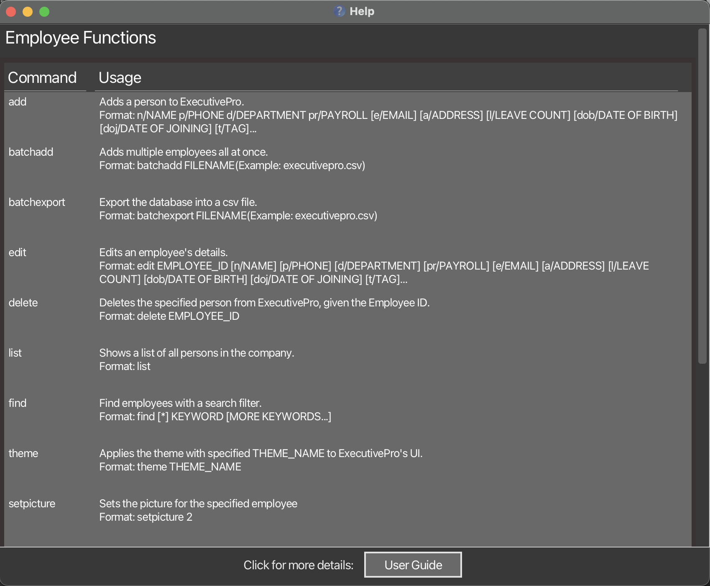
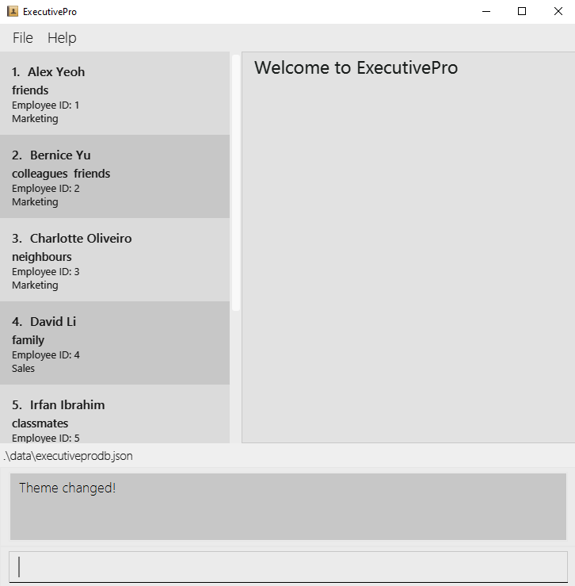
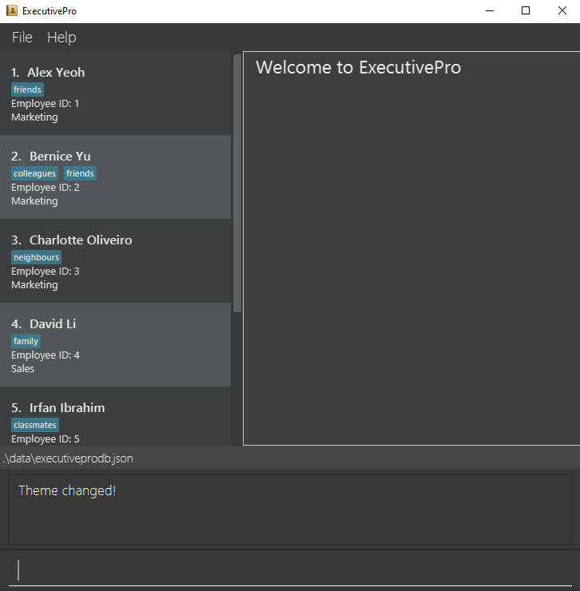
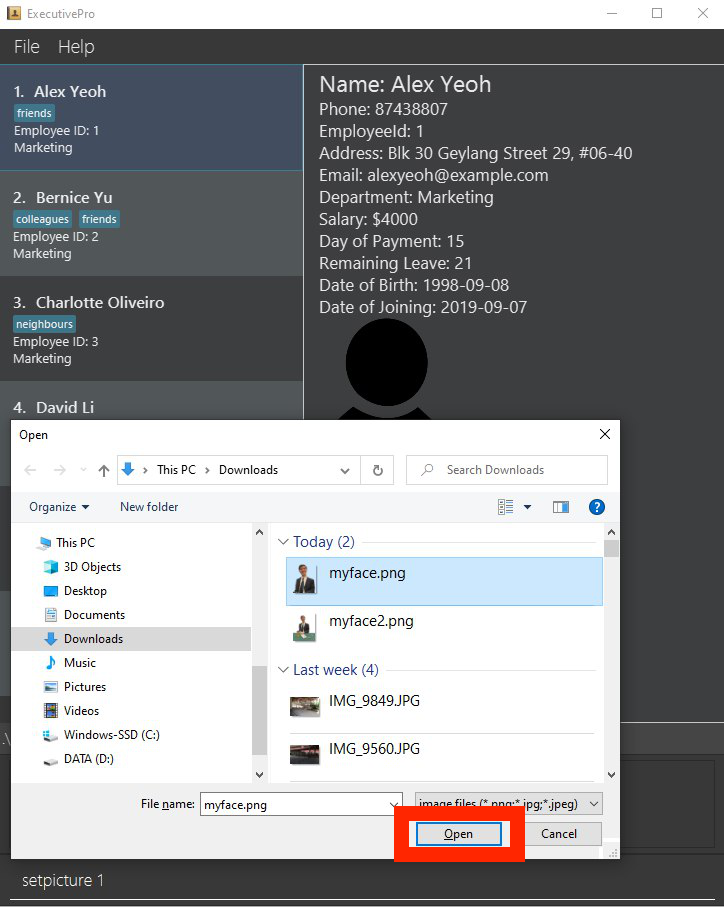
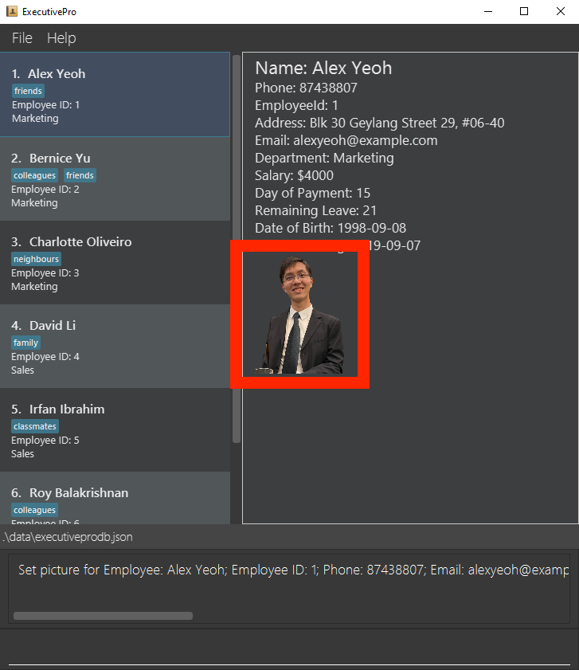

ExecutivePro (EP) is a **desktop app for Human Resource managers to manage their employee information, optimized for use via a Command Line Interface (CLI)** while still having the benefits of a Graphical User Interface (GUI). If you can type fast, EP can get your employee management tasks done faster than traditional GUI apps.

* Table of Contents
{:toc}
  
--------------------------------------------------------------------------------------------------------------------

## Quick start

1. Ensure you have Java `11` or above installed in your Computer.
    1. If you have installed Java before, check that you have the right version, which is Java `11`.
        - If you are using Windows, open up command prompt and type `java -version` and enter.
        - If you are using Mac, open up terminal and type `java -version` and enter.
    2. If you do not have Java `11`:
        - If you are using Windows/Linux/Intel-based Mac, you can download the latest version of Java from [here](https://www.oracle.com/java/technologies/downloads/).
        - If you are using an Apple Silicon Mac, you can install the Azul build of OpenJDK 11 version 
       from [here](https://www.azul.com/downloads/?version=java-11-lts&os=macos&architecture=arm-64-bit&package=jdk-fx).
2. Download the latest `ExecutivePro.jar` from [here](https://github.com/AY2223S2-CS2103T-W09-4/tp/releases).

3. Copy the file to the folder you want to use as the _home folder_ for your ExecutivePro.

4. Double-click the file to start the app. A GUI similar to below should appear in a few seconds. 
   Note how the app contains some sample data. 

  

5. You can start by typing a command in the command panel and pressing Enter to execute it. e.g. 
   typing **`help`** and pressing Enter will open the help window. 
   Some example commands you can try:

    - **`list`** : Lists all employees in the company.
   
    - **`add`** :`add n/Mark Doe p/98765432 e/markd@example.com a/311, Clementi Ave 2, #02-25 d/Marketing pr/1000 15
   t/SoftwareEngineer` : Adds an employee named `Mark Doe`, with fields phone number, email, address,
   department, payroll and tags to ExecutivePro's database.

    - **`delete 3`** : Deletes employee with ID 3.

    - **`exit`** : Exits the app.

6. Refer to the [Features](#features) below for details of each command.

--------------------------------------------------------------------------------------------------------------------
## Symbols and Syntax

Here are some of the symbols to take note of when going through this user guide:

| Symbol      | Meaning                                                           |
|-------------|-------------------------------------------------------------------|
| `code`      | Text relevant to commands or name of a file.                      |
| [`code`]    | The brackets around the code indicate that the field is optional. | 
| :bulb:      | Tips for ExecutivePro Users.                                      |
| :warning:   | Be wary and proceed with caution.                                 |

--------------------------------------------------------------------------------------------------------------------

## Features

* Items with `…` after them can either be omitted or used one or more times. 
  e.g. `[t/TAG]…` can be used as ` ` (i.e. 0 times), `t/friend`, `t/friend t/family` etc.

### Viewing help : `help`
There can be a lot of information to take in, so if you ever _feel lost_ while using ExecutivePro, 
getting help with the commands is just a simple step away.

Entering the `help` command will open up window with the command summary for the various functions of the application, 
and if you have more doubts, the _Help Window_ also contains a button to open up this User Guide in your browser.

Format: `help`

With this command, you should see a window like this appear.

### Adding an employee: `add`

How do we build an employee profile?

The first step is to add a new employee to the database, 
so ExecutivePro can begin managing their particulars and profile for you. 
To do this, use the add command, together with the employee particulars that you have available for this person.

Upon successfully adding a new employee, ExecutivePro will then keep track of the new profile and details in the 
database, and you are free to access and modify the particulars with other commands later on.

However, this function could fail (and ExecutivePro simply does not add any employee), if:

1. There are missing particulars which are compulsory, you can find these listed below.
2. The particulars are in the wrong format, the program will prompt you on the correct format. 
3. The new employee added is a duplicate, i.e. there is someone in the database who already shares the same name and
    details.

Format: `add n/NAME p/PHONE_NUMBER [e/EMAIL] [a/ADDRESS] d/DEPARTMENT pr/PAYROLL [l/LEAVE COUNT] [dob/DATE OF BIRTH] [doj/DATE OF JOINING] [t/TAG]...`

:bulb: **For Tags:**
A person can have any number of tags (including 0)

Examples:
* `add n/John Doe p/98765432 e/johnd@example.com a/John street, block 123, #01-01 d/Marketing pr/1000 15`
* `add n/Betsy Crowe p/1234567 e/betsycrowe@example.com a/Newgate street, block 576, #01-02 d/Sales pr/4000 1 dob/2000-04-21 doj/2022-01-04 t/friend`

### Adding multiple employees at once: `batchadd`

Tired of adding new employees one by one?
ExecutivePro allows you to add multiple employees at once from a `.csv` file.
This feature will come in handy when:

1. You are a new user and have your employee data stored in a `.csv` file.
2. There has been a recruitment cycle and the company has recruited multiple employees.

With this feature, you would not need to spend time to manually add each employee in!

Format: `batchadd FILENAME`

Example:`batchadd executivepro.csv`

Below are the steps to use this command:

**Step 1 (Creating CSV file) :**

Things to note:

- A header row is required to indicate the purpose of the field and must be the first row in the `.csv` file.
- For multiple tags for an employee, the tags should be separated by " \ ".

Order of headers is as such (**Order must be followed**):

| Index | Field           | Requirement    | 
|-------|-----------------|----------------|
| 1.    | `NAME`          | **Compulsory** | 
| 2.    | `PHONE`         | **Compulsory** |
| 3.    | `EMAIL`         | Optional       | 
| 4.    | `ADDRESS`       | Optional       | 
| 5.    | `DEPARTMENT`    | **Compulsory** | 
| 6.    | `PAYROLL`       | **Compulsory** | 
| 7.    | `LEAVECOUNT`    | Optional       | 
| 8.    | `DATEOFBIRTH`   | Optional       |
| 9.    | `DATEOFJOINING` | Optional       |
| 10.   | `TAGS`          | Optional       | 

Sample `.csv` file:

:warning: 
**Caution:** For the fields, do ensure that they follow the same specifications as in the [Field Formats below](#field-formats).

**Step 2 (Uploading CSV file) :**

1. Go to the folder where you stored the `jar` file.
2. Move CSV file to the `data` folder.
   

_If you are a new user (have not run any command yet), you will not see the `data` folder.
You can run the [`clear` command](#clearing-the-data--clear) to remove the sample employees first.
After this, you should be able to see the `data` folder._

**Step 3 (Running CSV file) :**

1. Once done, run `batchadd FILENAME` in the command panel.

If the command is successful, the employees in the file should be added to the database all at once, 
and it should look something like the below image.

The command could be unsuccessful, and there are a few potential causes of this:

1. There could be a *duplicate* entry in the file, i.e. two employees sharing the same identity in the file.
2. If any of the particulars in the wrong format, ExecutivePro will not be able to read the file properly 
   and the command will not run.

In the case of an unsuccessful Batch Add, **NONE** of the employees in the `.csv` will be added.
Also note that as of version `1.3` , this feature only supports `.csv` files and adding employees with the fields mentioned above.

In the upcoming versions, we will expand `batchadd` feature to:

1. Support different types of files
2. Include more fields like performance and leaves

### Exporting database into CSV file: `batchexport`

ExecutivePro allows you to export the employees' data into a `.csv` file.

Format: `batchexport FILENAME`

Example:`batchexport exported_database.csv`

Below are the steps to use this command:

**Step 1 (Exporting to CSV file) :**

1. Run `batchexport FILENAME` in the command panel. The result should look like the image below.

2. Go to the folder where you stored the `jar` file.
3. Locate the CSV file in the `data` folder.

If the command is successful, there should be CSV file that contains all the employees' details from the database,
and it should look something like the below image.

### Listing all employees : `list`

Shows a list of all employees and their details in the ExecutivePro database.

Format: `list`

### Editing an employee : `edit`

Edits an employee’s details in the ExecutivePro database.

Format: `edit EMPLOYEE_ID [n/NAME] [p/PHONE_NUMBER] [e/EMAIL] [a/ADDRESS] [d/DEPARTMENT] [pr/PAYROLL] [l/LEAVE_COUNT] [dob/DATE_OF_BIRTH] [doj/DATE_OF_JOINING] [t/TAG]...`

* Edits the details of the employee with the specified `EMPLOYEE_ID`. If such an employee doesn’t exist, an error message will be shown.
* At least one of the optional fields must be provided.
* Existing values will be updated to the input values.
* When editing tags, the existing tags of the person will be removed i.e adding of tags is not cumulative.
* You can remove all the person’s tags by typing `t/` without
  specifying any tags after it.

Examples:
*  `edit 1 p/91234567 e/johndoe@example.com` Changes the phone number and email address of the employee with ID `1` to be `91234567` and `johndoe@example.com` respectively.

### Taking Leave : `leave`

Helps an employee take leave.

Format: `leave EMPLOYEE_ID l/LEAVE_COUNT`

* Helps the employee with the specified `EMPLOYEE_ID` take leave. If such an employee doesn’t exist, an error message will be shown.
* Number of days of leave is specified by `LEAVE_COUNT`. If the employee does not have enough remaining leave, an error message will be shown.
* Existing leave count will decrease by the number of leave taken.

Examples:
*  `leave 1 l/3` Helps the employee with ID `1` take `3` days of leave.

### Locating employees by keyword: `find`

Shows a list of all employees in address book whose names match the keyword provided.

Format: `find [*] KEYWORD [MORE_KEYWORDS]`

* If asterisk (`*`) is inputted, it displays list of employees matching _all_ the given keywords. 
* If asterisk (`*`) is _not_ inputted, it displays list of employees matching _any_ of the given keywords. 
* Even if the keyword just partially matches a part of employees full name, it is considered a match.
* For finding department, the keyword has to be a full match.
* Keyword is to search for the name and department of the employee only, not any other details.

Examples:
* `find John Sales` displays list of all employees whose full name contains a 'John' in it, 
or they are in the 'Sales' department 
* `find * John Sales` displays list of all employees in the 'Sales' department who have a 'John' in their name

### Deleting an employee : `delete`

Deletes the details of the employee with the specified `EMPLOYEE_ID` from the ExecutivePro database.

Format: `delete EMPLOYEE_ID`

* You can delete the details of the employee with the specific `EMPLOYEE_ID`.
* The `EMPLOYEE_ID` refers to the id of an employee shown in the displayed employees list.
* The `EMPLOYEE_ID` **must be a positive integer** 1, 2, 3, …​

Examples:
`delete 2` deletes the employee with EMPLOYEE_ID 2 in ExecutivePro.

### Changing the UI theme : `theme`

Want to tweak the look of ExecutivePro?
This feature allows you to choose one of two appearances for ExecutivePro to suit your needs.

The `light` theme (black text on light background) improves readability in well-lit surroundings.

The `dark` theme (white text on dark background) can reduce eye strain in low-light conditions.

Format: `theme THEME_NAME`
* `THEME_NAME` is either `dark` (white text on dark background) or `light` (black text on white background).

Examples:
`theme light` applies the `light` theme to ExecutivePro.

### Setting an employee's picture : `setpicture`

This feature allows you to set a picture for the specified employee, so that you can upload ID photos for each employee.

Format: `setpicture EMPLOYEE_ID`

* Sets the picture of the employee with the specific `EMPLOYEE_ID`.
* The `EMPLOYEE_ID` refers to the id of an employee shown in the displayed employees list.
* The `EMPLOYEE_ID` **must be a positive integer** 1, 2, 3, …​

Examples:
To set the picture for the employee with EMPLOYEE_ID 2, enter `setpicture 2` into the command bar.
A file selector should appear, as shown below:

Search through your computer for the picture you want to set.
Select it by clicking the "Open" button on the file selector or by pressing the "Enter" key on your keyboard.

Click on the specified employee on the left, and your ExecutivePro should display their photo on the right like this.

### Exiting the program : `exit`

Exits the program.

Format: `exit`

### Clearing the data: `clear`

Clears all the data currently stored in the database.

If you are a new user, you can use this command after you have experimented with ExecutivePro to start keying in your actual employee information.

:warning: **Caution:**
Once you run this command, you lose all data immediately.

Format: `clear`

### Saving the data

ExecutivePro data are saved in the hard disk automatically after any command that changes the data. There is no need to save manually.

### Editing the data file

ExecutivePro data are saved as a JSON file `[JAR file location]/data/executivepro.json`. Advanced users are welcome to update data directly by editing that data file.

:exclamation: **Caution:**
If your changes to the data file makes its format invalid, ExecutivePro will discard all data and start with an empty data file at the next run.

--------------------------------------------------------------------------------------------------------------------

## FAQ

**Q**: How do I transfer my data to another Computer? 
**A**: Install the app on the other computer and overwrite the empty data file. This creates a new file that contains the data of your previous ExecutivePro home folder.
--------------------------------------------------------------------------------------------------------------------

## Field Formats

This table describes the requirements for the input format of the fields.

| Field                      | Prefix | Requirement                                                                                                                                                                                                                                                                                                                                                                                    | Example                                  |
|----------------------------|--------|------------------------------------------------------------------------------------------------------------------------------------------------------------------------------------------------------------------------------------------------------------------------------------------------------------------------------------------------------------------------------------------------|------------------------------------------|
| `NAME`                     | n/     | Only alphanumeric characters and spaces only.                                                                                                                                                                                                                                                                                                                                                  | `John Doe`, `Shawn Lee`                  |
| `PHONE`                    | p/     | Contain numbers only from 3 digits long to 15 digits long                                                                                                                                                                                                                                                                                                                                      | `80101126`, `973629831`, `999`           |
| `EMAIL`                    | e/     | Be in the format of local-part@domain.ending. "local-part" should contain only alphanumeric characters and/or certain special characters (+\_.-), and cannot start or end with any special characters. "domain" should start and end with alphanumeric characters, must be at least 2 characters long, and can contain hyphens. "ending" part must be at least 2 characters long (e.g. ".com") | `johnd@example.com`, `shawn@example.edu` |
| `ADDRESS`                  | a/     | Can take any value.                                                                                                                                                                                                                                                                                                                                                                            | `311, Clementi Ave 2, #02-25`            |
| `DEPARTMENT`               | d/     | Only alphanumeric characters                                                                                                                                                                                                                                                                                                                                                                   | `Sales`, `General Management`            |
| `PAYROLL`                  | pr/    | Can take any value.                                                                                                                                                                                                                                                                                                                                                                            | `1000 15`                                |
| `LEAVE`                    | l/     | Must be an integer less than `21`.                                                                                                                                                                                                                                                                                                                                                             | `1`, `10`, `20`                          |
| `DATE_OF_BIRTH`            | dob/   | Date in YYYY-MM-DD format.                                                                                                                                                                                                                                                                                                                                                                     | `2022-01-10`                             |
| `DATE_OF_JOINING`          | doj/   | Date in YYYY-MM-DD format.                                                                                                                                                                                                                                                                                                                                                                     | `2022-12-10`                             |
| `TAG`                      | t/     | Only alphanumeric characters and spaces only.                                                                                                                                                                                                                                                                                                                                                  | `Software Engineer`, `Manager`           |
                                                                                                                                                                                                                                                              
--------------------------------------------------------------------------------------------------------------------

## Command summary

| Action             | Format, Examples                                                                                                                                                                                                                                                                                                                      |
|--------------------|---------------------------------------------------------------------------------------------------------------------------------------------------------------------------------------------------------------------------------------------------------------------------------------------------------------------------------------|
| **Help**           | `help`                                                                                                                                                                                                                                                                                                                                |
| **Add**            | `add EMPLOYEE_ID [n/NAME] [p/PHONE_NUMBER] [e/EMAIL] [a/ADDRESS] [d/DEPARTMENT] [pr/PAYROLL] [l/LEAVE_COUNT] [dob/DATE_OF_BIRTH] [doj/DATE_OF_JOINING] [t/TAG]...`   e.g., `add 1 n/John Doe p/98765432 e/johnd@example.com a/John street, block 123, #01-01 d/Marketing pr/4000 15 l/19 dob/2000-04-21 doj/2022-01-04 t/friends ` |
| **BatchAdd**       | `batchadd FILENAME`   e.g., `batchadd executivepro.csv`                                                                                                                                                                                                                                                                            |
| **BatchExport**    | `batchexport FILENAME`   e.g., `batchexport exported_database.csv`                                                                                                                                                                                                                                                                 |
| **List**           | `list`                                                                                                                                                                                                                                                                                                                                |
| **Edit**           | `edit EMPLOYEE_ID [n/NAME] [p/PHONE_NUMBER] [e/EMAIL] [a/ADDRESS] [d/DEPARTMENT] [pr/PAYROLL] [l/LEAVE_COUNT] [dob/DATE_OF_BIRTH] [doj/DATE_OF_JOINING] [t/TAG]...`  e.g.,`edit 1 p/91234567 e/johndoe@example.com`                                                                                                                |
| **Leave**          | `leave EMPLOYEE_ID l/LEAVE_COUNT`  e.g.,`leave 1 l/3`                                                                                                                                                                                                                                                                              |
| **Find**           | `find KEYWORD [MORE_KEYWORDS]`  e.g., `find James Jake`                                                                                                                                                                                                                                                                            |
| **Delete**         | `delete EMPLOYEE_ID`  e.g., `delete 3`                                                                                                                                                                                                                                                                                             |
| **Theme**          | `theme THEME_NAME`   e.g., `theme light`                                                                                                                                                                                                                                                                                           |
| **SetPicture**     | `setpicture EMPLOYEEID`   e.g., `setpicture 2`                                                                                                                                                                                                                                                                                     |
| **Exit**           | `exit`                                                                                                                                                                                                                                                                                                                                |
| **Clear**          | `clear`                                                                                                                                                                                                                                                                                                                               |

